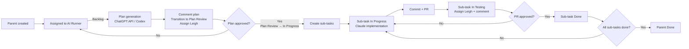

# Moveware AI Runner , Pilot Workflow & Architecture

## Purpose
This pilot lets Jira remain the single GUI, while automating:

- Plan generation for parent tickets (ChatGPT API / Codex)
- Sub-task creation (Jira REST)
- Implementation for sub-tasks (Claude API , Sonnet 4.5)
- Git branch, commits, PR creation (Git + GitHub CLI)
- Jira status transitions, reassignment, and comments

The design is production-grade (audit trail, secret management, minimal open ports), even though it is a pilot.

## Jira status model
Statuses used in this pilot (exact names):

- **Backlog**
- **Plan Review**
- **In Progress**
- **In Testing**
- **Done**
- **Blocked**

Key rule:

- “Plan Approved” is a transition, **Plan Review → In Progress**.

## Parent + sub-task model
We use **one parent ticket per feature / sprint unit**, and **sub-tasks for execution units**.

- Parent ticket holds:
  - The AI Implementation Plan
  - Approval history (comments)
  - Final outcome summary
- Sub-tasks represent:
  - Discrete, reviewable work items
  - Each sub-task maps to a branch + PR cycle

## End-to-end flow

### 1) Planning phase (ChatGPT API / Codex)
Trigger: **Parent ticket** is assigned to **AI Runner** while in **Backlog**.

Steps:

1. Runner reads the parent ticket (summary + description + existing comments).
2. Runner calls **ChatGPT API / Codex** to produce:
   - Proposed approach
   - File list (expected)
   - Risks / unknowns
   - Acceptance criteria
   - A list of sub-tasks (title + description)
3. Runner posts the plan back to the parent ticket as a Jira comment.
4. Runner transitions the parent ticket to **Plan Review** and assigns it to **Leigh**.

### 2) Plan review (Human)
Leigh reviews the plan in Jira.

Outcomes:

- **Approve:** transition **Plan Review → In Progress**.
- **Reject / refine:** add a comment and reassign to AI Runner (it will regenerate the plan).
- **Blocked:** transition to **Blocked** if waiting on something external.

### 3) Sub-task creation (System automation)
Trigger: parent transitions to **In Progress**.

Steps:

1. Runner creates the sub-tasks under the parent (Jira REST).
2. Runner assigns all sub-tasks to **AI Runner**.
3. Runner begins work **sequentially**:
   - Moves the next sub-task to **In Progress**
   - Executes it end-to-end

Why sequential for the pilot?

- Keeps cost and risk predictable
- Reduces merge conflicts
- Makes the “AI Runner” behaviour easy to observe and iterate on

### 4) Execution phase (Claude API , Sonnet 4.5)
Trigger: a **sub-task** is **In Progress** and assigned to **AI Runner**.

Steps:

1. Runner checks out the repo, creates a branch named with the Jira key.
2. Runner calls **Claude API** to implement the task.
3. Runner runs repo commands (optional) such as tests / lint.
4. Runner commits with message containing the Jira key.
5. Runner pushes and creates a PR.
6. Runner updates the sub-task:
   - Transition to **In Testing**
   - Assign to **Leigh**
   - Comment with summary + PR link

### 5) PR review loop (Human ↔ AI)
Leigh reviews the PR.

Outcomes:

- **PR approved and merged:** transition sub-task to **Done**.
- **Changes required:** comment in Jira and reassign to **AI Runner**.
  - Runner pulls the latest branch, applies fixes, pushes updates, and re-requests review.

### 6) Parent completion
When all sub-tasks are **Done**, Runner transitions the parent ticket to **Done** and posts a final summary.

## Where each model fits

- **ChatGPT API / Codex**
  - Interpreting requirements into an implementable plan
  - Repo analysis and integration/build troubleshooting
  - Producing structured sub-task breakdowns

- **Claude API (Sonnet 4.5)**
  - Feature implementation
  - Bug fixes
  - Refactors
  - Draft commit/PR messaging (when helpful)

## Suggested improvements (optional)
These are worth considering after the pilot is stable:

1. **PR-based gating instead of status-based gating**
   - e.g., “In Testing” only after CI passes.
2. **Small change sets**
   - Enforce diff size thresholds (line count) for safety.
3. **Policy checks**
   - Disallow secrets in commits.
   - Require tests for certain folders.
4. **Second reviewer option**
   - Add an “AI Code Review” pass (Codex) before sending to Leigh.

## Jira workflow definition (copy into Jira)
See: `docs/jira-workflow.md`

## Required external accounts / API keys

### Jira Cloud
- Jira Cloud site URL
- Jira API token (for a service user)
- Account IDs for:
  - **AI Runner** user
  - **Leigh** user
- Webhook configured to call the orchestrator endpoint

### GitHub
- GitHub Personal Access Token (classic or fine-grained) with:
  - repo read/write
  - pull request create
- `gh` CLI auth on the server for the `moveware-ai` Linux user

### AI providers
- OpenAI API key (for ChatGPT API / Codex)
- Anthropic API key (for Claude Sonnet)

## Environment variables
See: `.env.example` (copy to `/etc/moveware-ai.env`).

## Mermaid diagram (high-level)

