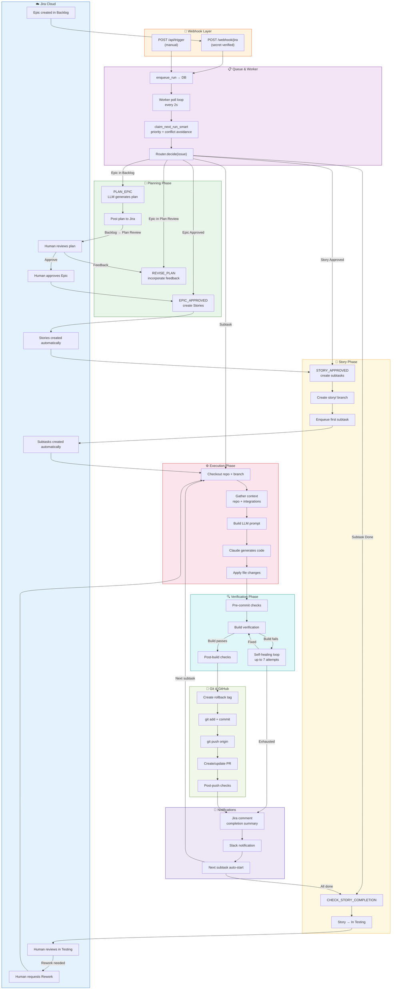
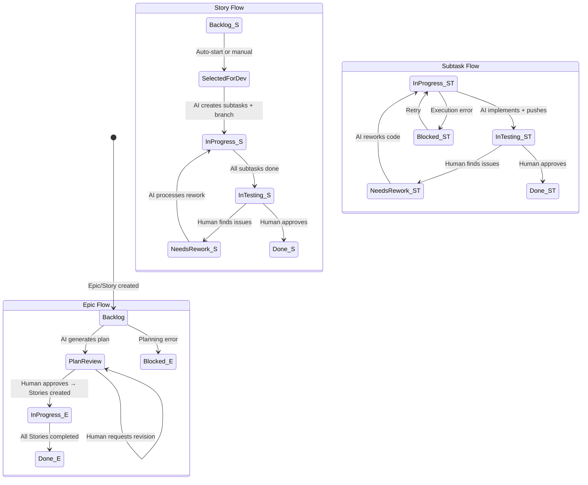
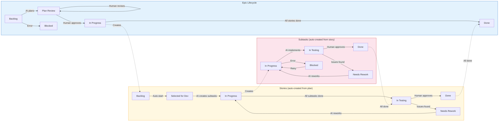
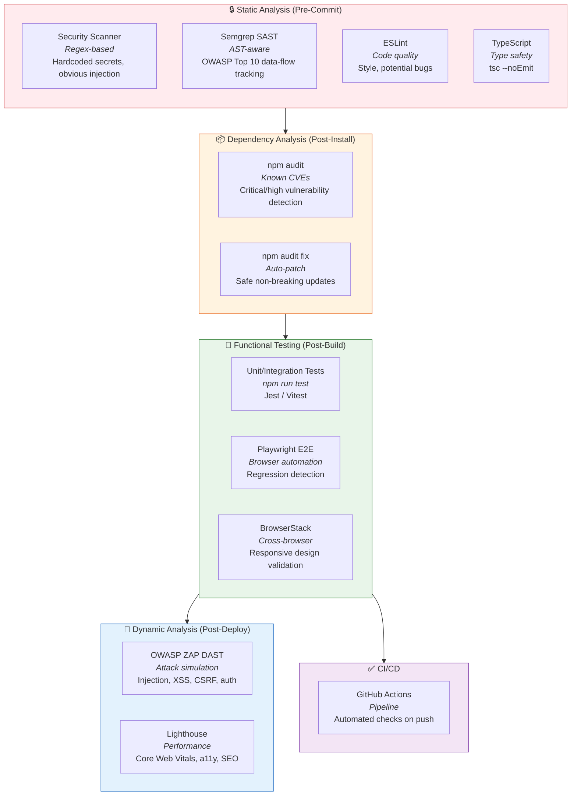
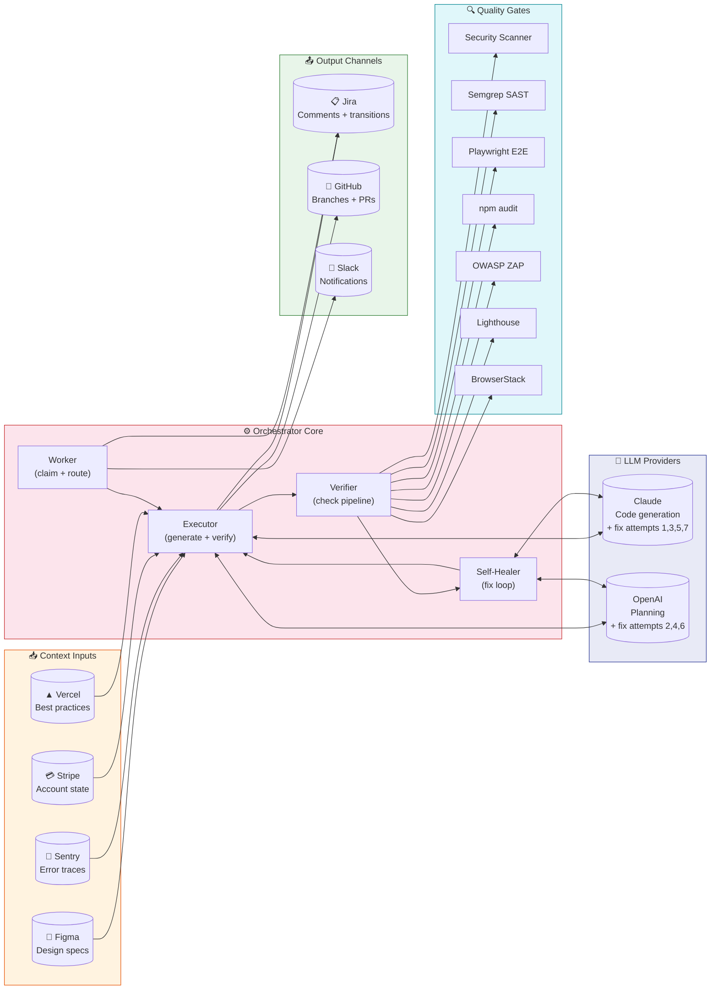
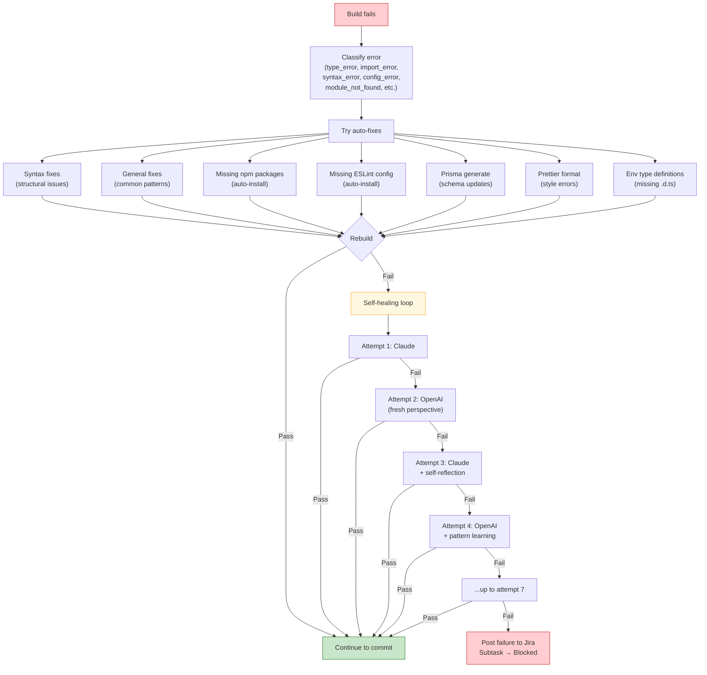

# AI Orchestrator — System Flow Diagrams

Complete system architecture and workflow diagrams for the Moveware AI Runner.

---

## 1. End-to-End System Overview



---

## 2. Jira Status Transitions



---

## 3. Subtask Execution Pipeline (Detailed)

```mermaid
flowchart TB
    START([Subtask claimed by Worker]) --> BRANCH

    subgraph CHECKOUT["1. Repository Setup"]
        BRANCH[Checkout repo]
        BRANCH --> DECIDE_BRANCH{Independent<br/>subtask?}
        DECIDE_BRANCH -->|Yes| AI_BRANCH["Branch: ai/{ISSUE-KEY}"]
        DECIDE_BRANCH -->|No| STORY_BRANCH["Branch: story/{PARENT-KEY}"]
    end

    subgraph CONTEXT["2. Context Gathering"]
        AI_BRANCH --> CTX_REPO["Repo context<br/>(git log, structure,<br/>package.json, relevant files)"]
        STORY_BRANCH --> CTX_REPO
        CTX_REPO --> CTX_SKILLS["Load AI skills<br/>(nextjs, prisma, stripe, etc.)"]
        CTX_SKILLS --> CTX_COMMENTS["Human comments<br/>from Jira"]
        CTX_COMMENTS --> CTX_INTEGRATIONS
    end

    subgraph INTEGRATIONS["3. External Context (Auto-detected)"]
        CTX_INTEGRATIONS["Check integrations"]
        CTX_INTEGRATIONS --> FIGMA["🎨 Figma<br/>Design specs from URLs"]
        CTX_INTEGRATIONS --> SENTRY["🐛 Sentry<br/>Stack traces for bugs"]
        CTX_INTEGRATIONS --> STRIPE["💳 Stripe<br/>Products, prices, webhooks"]
        CTX_INTEGRATIONS --> VERCEL["▲ Vercel<br/>Next.js best practices"]
    end

    subgraph GENERATE["4. Code Generation"]
        FIGMA --> BUILD_PROMPT
        SENTRY --> BUILD_PROMPT
        STRIPE --> BUILD_PROMPT
        VERCEL --> BUILD_PROMPT
        BUILD_PROMPT["Build LLM prompt<br/>(context + task + security rules)"]
        BUILD_PROMPT --> CLAUDE["☁️ Claude API call<br/>JSON response with files"]
        CLAUDE --> PARSE["Parse response<br/>implementation_plan, files[], summary"]
        PARSE --> APPLY["Apply file changes<br/>(create / update / delete)"]
    end

    subgraph PREVERIFY["5. Pre-Commit Verification"]
        APPLY --> PKG_JSON["📦 Package.json syntax"]
        PKG_JSON --> SEC_SCAN["🔒 Security scanner<br/>(regex: secrets, injection, XSS)"]
        SEC_SCAN --> SEMGREP["🛡️ Semgrep SAST<br/>(AST: OWASP data-flow)"]
        SEMGREP --> TSC["📘 TypeScript check<br/>(tsc --noEmit)"]
        TSC --> ESLINT["📏 ESLint"]
        ESLINT --> IMPORTS["📂 Import resolution"]
    end

    subgraph BUILD["6. Build Verification"]
        IMPORTS --> NPM_INSTALL["npm install"]
        NPM_INSTALL --> NPM_AUDIT_FIX["npm audit fix<br/>(safe patches)"]
        NPM_AUDIT_FIX --> NPM_AUDIT["npm audit<br/>(vulnerability report)"]
        NPM_AUDIT --> TSC2["tsc --noEmit<br/>(post-install)"]
        TSC2 --> NPM_BUILD["npm run build"]
        NPM_BUILD --> BUILD_OK{Build<br/>passed?}
    end

    BUILD_OK -->|Yes| POST_BUILD
    BUILD_OK -->|No| SELF_HEAL

    subgraph HEALING["7. Self-Healing Loop (max 7 attempts)"]
        SELF_HEAL["Classify error"]
        SELF_HEAL --> AUTO_FIX["Try auto-fixes<br/>(syntax, missing pkgs,<br/>Prettier, Prisma, env types)"]
        AUTO_FIX --> AUTO_OK{Fixed?}
        AUTO_OK -->|Yes| NPM_BUILD
        AUTO_OK -->|No| LLM_FIX["LLM fix attempt"]
        LLM_FIX --> ODD{Attempt<br/>number?}
        ODD -->|"Odd (1,3,5,7)"| CLAUDE_FIX["Claude fixes"]
        ODD -->|"Even (2,4,6)"| OPENAI_FIX["OpenAI fixes<br/>(fresh perspective)"]
        CLAUDE_FIX --> APPLY_FIX["Apply fix + rebuild"]
        OPENAI_FIX --> APPLY_FIX
        APPLY_FIX --> REBUILD_OK{Build<br/>passed?}
        REBUILD_OK -->|Yes| POST_BUILD
        REBUILD_OK -->|No, attempts left| SELF_HEAL
        REBUILD_OK -->|No, exhausted| POST_MORTEM["🔬 Post-Mortem Analysis"]
        POST_MORTEM --> PM_LEARN["Extract KB rules<br/>from full error chain"]
        PM_LEARN --> PM_ISSUE["Create GitHub Issue<br/>on runner repo"]
        PM_ISSUE --> PM_REQUEUE{First<br/>post-mortem?}
        PM_REQUEUE -->|Yes| REQUEUE["Re-queue run<br/>with new knowledge"]
        PM_REQUEUE -->|No| FAIL_COMMENT["Post failure<br/>to Jira"]
        REQUEUE --> SELF_HEAL
    end

    subgraph POSTBUILD["8. Post-Build Checks"]
        POST_BUILD["Post-build"]
        POST_BUILD --> PW_TEST["🎭 Playwright E2E tests"]
        POST_BUILD --> AUDIT_RPT["📋 npm audit report"]
    end

    subgraph GITFLOW["9. Git & GitHub"]
        PW_TEST --> ROLLBACK_TAG["Create rollback tag"]
        AUDIT_RPT --> ROLLBACK_TAG
        ROLLBACK_TAG --> GIT_COMMIT["git add -A && git commit"]
        GIT_COMMIT --> GIT_PUSH["git push origin"]
        GIT_PUSH --> PR_CREATE{Independent?}
        PR_CREATE -->|Yes| CREATE_PR["gh pr create<br/>ai/{ISSUE-KEY} → main"]
        PR_CREATE -->|No| UPDATE_PR["Update Story PR<br/>story/{PARENT-KEY}"]
    end

    subgraph POSTPUSH["10. Post-Push Checks (non-blocking)"]
        CREATE_PR --> GH_CI["✅ GitHub Actions CI"]
        UPDATE_PR --> GH_CI
        GH_CI --> AUDIT_JIRA["📋 npm audit → Jira"]
        AUDIT_JIRA --> PW_JIRA["🎭 Playwright → Jira"]
        PW_JIRA --> SG_JIRA["🛡️ Semgrep → Jira"]
        SG_JIRA --> ZAP_CHECK{Deployed<br/>URL?}
        ZAP_CHECK -->|Yes| BS["📱 BrowserStack responsive"]
        ZAP_CHECK -->|Yes| LH["⚡ Lighthouse performance"]
        ZAP_CHECK -->|Yes| ZAP["🔐 OWASP ZAP DAST"]
        ZAP_CHECK -->|No| COMPLETE
        BS --> COMPLETE
        LH --> COMPLETE
        ZAP --> COMPLETE
    end

    subgraph FINISH["11. Completion"]
        COMPLETE["Build Jira comment<br/>(summary + all check results)"]
        COMPLETE --> JIRA_COMMENT["📝 Post to Jira"]
        JIRA_COMMENT --> SLACK_NOTIFY["📢 Slack notification"]
        SLACK_NOTIFY --> TRANSITION["Subtask → In Testing<br/>Assign to human"]
        TRANSITION --> NEXT{More<br/>subtasks?}
        NEXT -->|Yes| NEXT_ST["Start next subtask"]
        NEXT -->|No| STORY_DONE["Story → In Testing"]
        NEXT_ST --> START
    end

    FAIL_COMMENT --> BLOCKED_ST2["Subtask → Blocked<br/>Assign to human"]

    style CHECKOUT fill:#e3f2fd,stroke:#1565c0
    style CONTEXT fill:#f3e5f5,stroke:#6a1b9a
    style INTEGRATIONS fill:#fff3e0,stroke:#e65100
    style GENERATE fill:#fce4ec,stroke:#c62828
    style PREVERIFY fill:#e0f7fa,stroke:#00838f
    style BUILD fill:#f1f8e9,stroke:#558b2f
    style HEALING fill:#fff8e1,stroke:#f9a825
    style POSTBUILD fill:#e8eaf6,stroke:#283593
    style GITFLOW fill:#f1f8e9,stroke:#558b2f
    style POSTPUSH fill:#ede7f6,stroke:#4527a0
    style FINISH fill:#e8f5e9,stroke:#2e7d32
```



---

## 4. Epic → Story → Subtask Lifecycle



---

## 5. Branching & PR Strategy

```mermaid
gitgraph
    commit id: "main"
    branch "story/PROJ-10"
    checkout "story/PROJ-10"
    commit id: "PROJ-11: Header component"
    commit id: "PROJ-12: Navigation links"
    commit id: "PROJ-13: Mobile responsive"
    checkout main
    merge "story/PROJ-10" id: "Story PR merged"
    branch "ai/PROJ-20"
    checkout "ai/PROJ-20"
    commit id: "PROJ-20: Independent fix"
    checkout main
    merge "ai/PROJ-20" id: "Independent PR merged"
```

**Branching rules:**
- **Story subtasks** → all commit to `story/{PARENT-KEY}` branch → single Story PR
- **Independent subtasks** → each gets `ai/{ISSUE-KEY}` branch → individual PR
- **Rollback tags** → `rollback/{ISSUE-KEY}/{timestamp}` created before each commit

---

## 6. Security & Testing Layers



---

## 7. Integration Architecture



---

## 8. Self-Healing Decision Tree



---

## Quick Reference: All Jira Statuses

| Status | Used By | Meaning |
|--------|---------|---------|
| **Backlog** | Epic, Story | Not yet started |
| **Plan Review** | Epic | AI plan awaiting human approval |
| **Selected for Development** | Story | Ready for AI to pick up |
| **In Progress** | Epic, Story, Subtask | AI is actively working |
| **In Testing** | Story, Subtask | AI finished, human reviewing |
| **Needs Rework** | Story, Subtask | Human found issues, sent back to AI |
| **Done** | Epic, Story, Subtask | Approved and complete |
| **Blocked** | Epic, Subtask | Error occurred, needs attention |

## Quick Reference: All Integrations

| Integration | Type | Trigger | Blocks Commit? |
|-------------|------|---------|----------------|
| Security Scanner | SAST (regex) | Every commit | Critical only |
| Semgrep | SAST (AST) | Every commit (if installed) | ERROR level |
| npm audit | SCA | After npm install | No (warnings) |
| Playwright | E2E | If playwright.config exists | Yes (failures) |
| OWASP ZAP | DAST | If deployed URL + ZAP running | High risk only |
| BrowserStack | Visual | If deployed URL + UI changes | No (warnings) |
| Lighthouse | Performance | If deployed URL + UI changes | No (warnings) |
| GitHub Actions | CI | Every push | No (informational) |
| Figma | Context | Figma URL in Jira description | N/A (input) |
| Sentry | Context | Sentry ref in Jira description | N/A (input) |
| Stripe | Context | Payment keywords in task | N/A (input) |
| Vercel | Context | Next.js project detected | N/A (input) |
| Slack | Notification | Task complete/fail/story done | N/A (output) |
